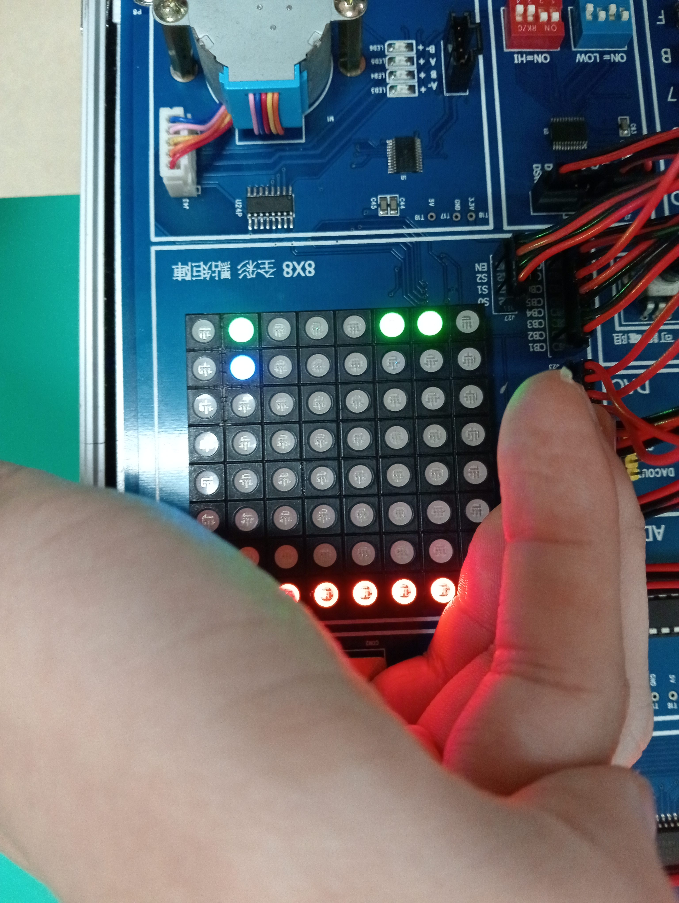
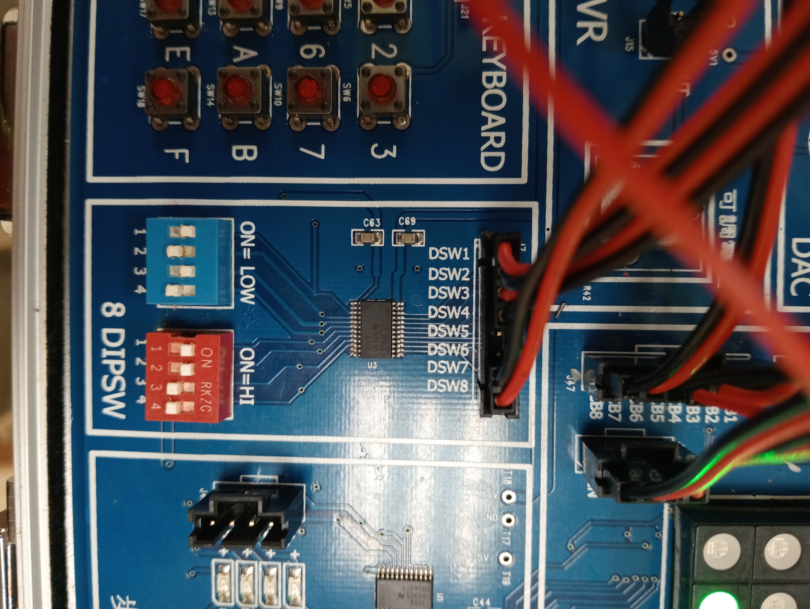
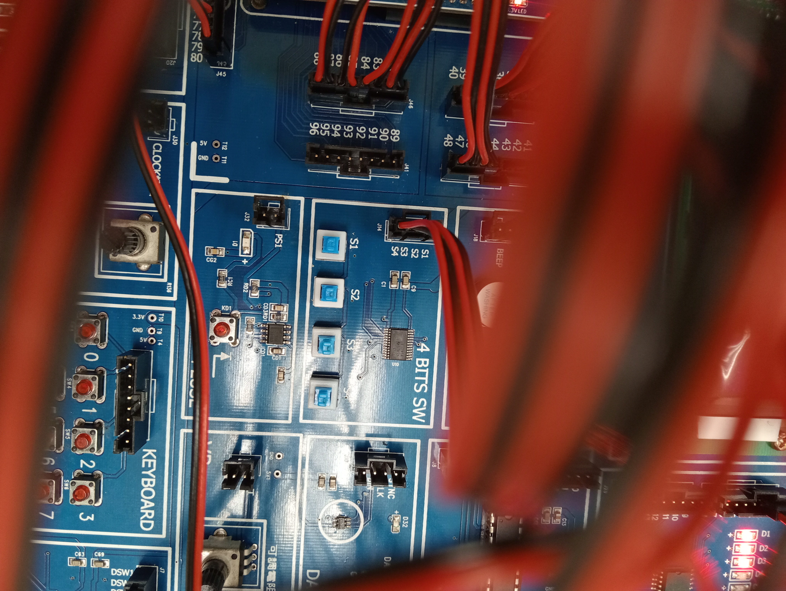

# FPGA Project 打磚塊（板子分開版，待修復）

綠色：板子（磁場不和版）、藍色：小球、紅色：磚塊
# 組員
- 111321040 謝逸強 資工二
# 操作方式
1. 一開始8×8全彩點矩陣分別會出現板子、小球及磚塊
2. 打開 8 DIPSW 的start鍵（藍1）及 撿球鍵（藍3）
3. 利用 4 BITS SW 的 S1（左）、S2（右）、S3（發球）及 S4（加快速度）進行遊玩
4. 當小球撞到磚塊時 7 SEG 會顯示分數（理想狀態：1分/塊 實際狀態：？分/塊）
5. 磚塊不見後beep會大吼一聲，為聰明才智的player喝彩
6. 若小球不慎落地，可再次關閉開啟撿球鍵（藍3）
7. 遊戲共有三條命，通過成功時候全彩點矩陣會出現笑臉（酒窩版），反之則會出現哭臉（毀容版）
# 遊戲難度
- 開啟遊戲後玩家需迅速分析最下面的哪三個點才是真正的板子 :)
# 詳細介紹

- 藍1：開始遊戲、藍2：重啟遊戲、藍3：撿球鍵、藍4：暫停鍵
- 紅3：顯示分數的十位數、紅4：顯示分數的個位數

- S1:左、S2：右、S3：發球

# 謝謝助教
